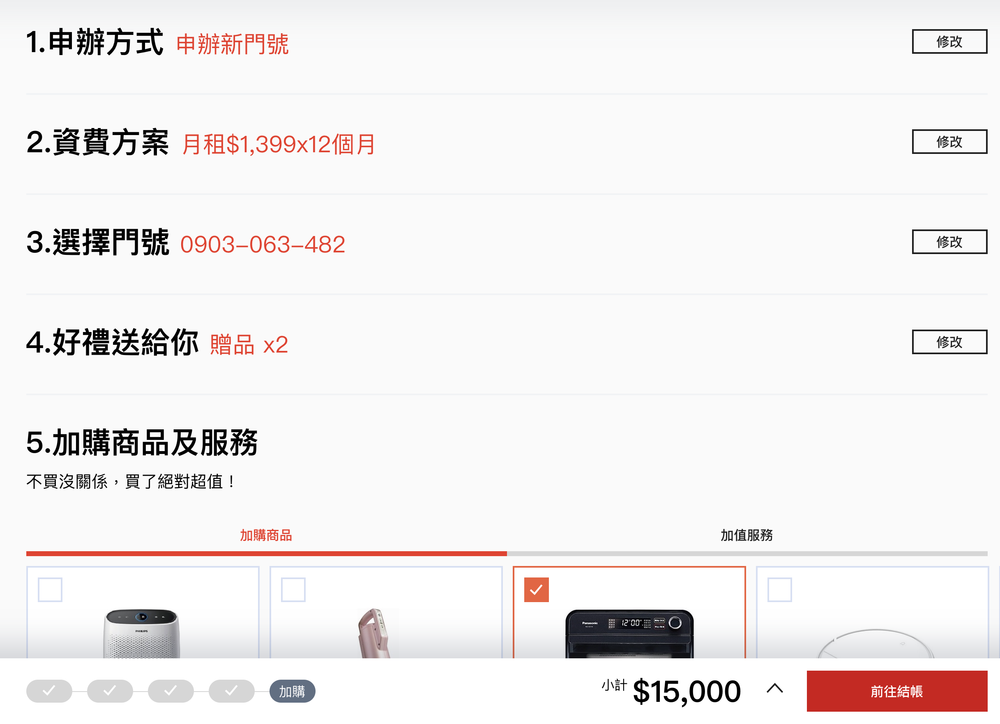

# 申辦流程



申辦流程較為複雜，在此將重要的資料結構及參數條列說明。

**主要流程結構，可參考 Mock**
```jsx
export const newFlow = [
  {
    id: 'plan-select',
    slug: '資費', // 步驟簡述，顯示於購物車
    title: '資費方案', // 步驟標題
    name: 'plan', // 步驟欄位名稱
    description: '吃到飽吃不飽這裡都有', // 步驟說明
    type: 'radio-card', // 辨別顯示的格式
    // radio 申辦方式
    // radio-card 資費方案
    // radio-carousel 門號選擇
    // checkbox-card 商品選擇
    // tab-checkbox-card 有 tab 的商品選擇
    // input-validation 攜入門號確認
    // identity-validation 續約身份驗證
    options: [...] // 選項
  }
]
```

**State 用途**
```jsx
  this.state = {
    prevPage: '', // 
    modalOpen: false,  // 控制跳窗顯示
    isRenewal: false,  // 根據網址判斷是否為續約
    isBackward: false, // 判斷是否由結帳流程進入，開發段應由 prevPage 判斷
    inputValidationValid: false,  // 確認驗證格式是否正確
    canEdit: true,  // 控制步驟是否可編輯
    cartUpdate: false, // 切換購物車是否需要更新
    currentModal: { }, // 控制 Modal 內容
    productInfo: { ...Mock.Product },  // 產品內容
    currentImage: [],  // 控制可選擇顏色時的商品圖呈現
    identityPass: false, // 確認身分驗證格式是否正確
    sldierSetting: { ... }, // 商品圖輪播格式

    // 個別提示訊息內容，根據點選的按鈕切換
    installmentCount: 74,
    installmentModal: { ... },
    welfareModal: {...},
    
    // 初始的申辦流程，只有申辦方式
    originFlow: Mock.planStep,
    // 預設為新申辦，帶入新申辦流程資料
    applyFlow: [...Mock.planStep, ...Mock.newFlow],

    // 貨到通知表單內容
    deliverySubmit: false,
    deliveryForm: {
      type: { value: '新申辦' },
      name: { value: '', required: true },
      contact: { value: '', required: true },
    },
    // 預約表單內容
    reservationSubmit: false,
    reservationForm: {
      reserve_no: { value: '', required: true },
      id_number: { value: '', required: true },
    },

    // 使用既有的表單組件，再根據表單的值修改帶入購物車的內容，根據實際流程需要使用
    form: {
      color: { value: Mock.Product.colors[0].value, required: true },
      with_plan: { value: window.location.hash === '#device-alone' ? '0' : '1', required: true },
      input_validation: { value: '', required: true },
      id_number: { value: '', required: true },
      scid: { value: '', required: true },
      apply_method: { value: '' },
      number: { value: 1, required: true },
      plan: { value: '', required: true },
      phone_number: { value: '', required: true },
      gift: { value: '', required: true },
      extra_product: { value: '', required: true },
      extra_plan: { value: '', required: true },
    },
    // 購物車結果根據表單內容更新為適合 UI 顯示的格式
    cart: {
      apply_method: '',
      plan: null,
      product: null,
      identity_validation: null,
      input_validation: null,
      phone_number: null,
      gift: [],
      extra_product: [],
      extra_plan: [],
    },

    // 紀錄目前的步驟數
    step: 0,
    // 紀錄目前要編輯的步驟，預設為 -1
    editStep: -1,
  };
```

**函式說明**
| 函式名稱 | 用途 | 細項 | 
| :--- | :--- | :--- | :--- | :--- |
| componentDidMount | 1. 判斷是否為老客戶續約，並帶入相關設定<br/>2.判斷是否有 redux 紀錄；若有，則用紀錄寫入 state 並捲動到對應位置<br> 3.若以上皆非則從 Mock 或 API 帶入商品及預設資料 | **window event** <br/>1. popstate 回上一頁時根據網址切換步驟<br>2. scroll 根據捲動的位置更改 hash |
| detectStep | 1. 若在目前頁面，且步驟還沒在第一步，則回到上一步。沒有上一步則回上一頁 |  |
| detectSection | 1. 根據畫面位置切換 hash |  |
| inputChange | 表單內容更新 | 1. 若回到第一步修改申辦方式，跳出通知<br/>2. 選擇申辦方式切換到對應步驟 |
| canscelSelect | 取消切換申辦方式，還原為既有狀態 |  |
| resetFormset | 確認切換申辦方式，重設表單及購物車資料 |  |
| stepChange | 步驟切換，並執行 scrollToPosition |  |
| scrollToPosition | 捲動到對應位置並修改 hash |  |
| valuePreview | 預覽選擇內容 |  |
| submit | 進入結帳流程 |  |