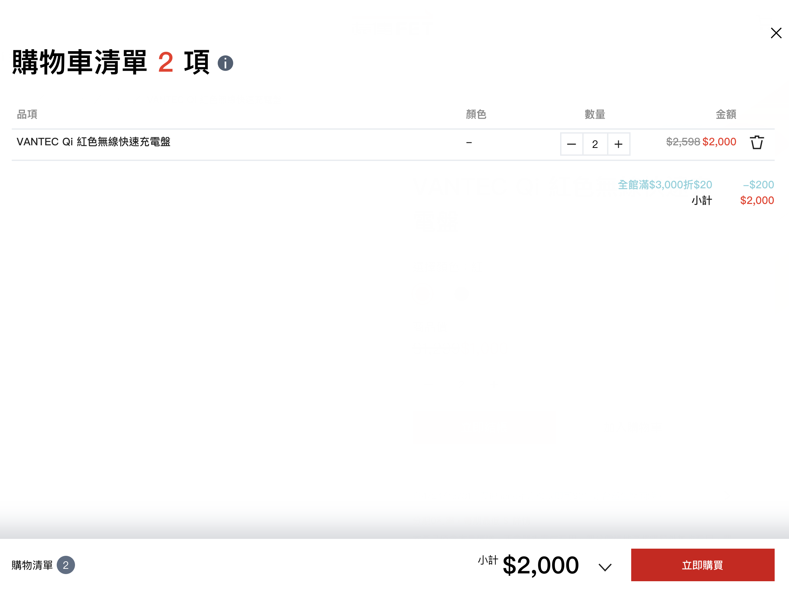

# Cart

購物車共用位置極多，為資料同步性使用 Redux 暫存資料。



### Usage
```jsx

import Cart from '../components/Cart';

class Page extends React.Component {
  render () {
    return (
      <Cart
        onUpdate={this.updateFormFromCart}
        afterUpdate={(e) => this.setState({ cartUpdate: false })}
        update={this.state.cartUpdate}
        cart={this.state.cart}
      />
    )
  }
}
```
### Sources
```jsx
import React from 'react';
import Formsy from 'formsy-react';
import Button from './Button';
import Tooltip from './Tooltip';
import NumberSelector from './form/NumberSelector';
import PropTypes from 'prop-types';
import formatNumber from '../utils/numberFormatter';

import { setCartData, removeCartData, updateCartData } from '../stores/action';
import { bindActionCreators } from 'redux';
import { connect } from 'react-redux';

import { setMobile } from './util';

class Cart extends React.Component {
  constructor(props) {
    super(props);
    this.cart = React.createRef();

    this.scrollTimeout = false;
    this.state = {
      isMobile: window.innerWidth < 768,
      currentItem: -1,
      currentType: '',
      detailOpen: false,
      totalNumbers: 0,
      total: 0,
      fixBottom: 0,
      cart: this.props.cart,
    };
  }

  componentDidMount = () => {
    if (typeof window !== 'undefined') {
      // 控制畫面捲動時控制條的位置
      window.addEventListener('resize', (e) => setMobile(this));
      window.addEventListener('scroll', this.setPosition);
      window.addEventListener('mousewheel', this.setPosition);
    }

    // 計算金額
    this.countAmount();
  };

  componentWillUnmount = () => {
      // 離開頁面時移除事件釋放記憶體
    window.removeEventListener('resize', (e) => setMobile(this));
    window.removeEventListener('scroll', this.setPosition);
    window.removeEventListener('mousewheel', this.setPosition);
  };

  componentDidUpdate = (prevProps, prevState) => {
    // 根據頁面中 fui-section-collapse 元素調整控制條樣式
    if (document.getElementsByClassName('fui-section-collapse').length) {
      if (
        this.state.totalNumbers === 0 &&
        document.getElementsByClassName('fui-section-collapse')[0].classList.contains('with-cart')
      ) {
        document.getElementsByClassName('fui-section-collapse')[0].classList.remove('with-cart');
      } else if (this.state.totalNumbers > 0) {
        document.getElementsByClassName('fui-section-collapse')[0].classList.add('with-cart');
      }
    }

    // 更新購物車資料
    if (this.isSamCart(prevProps.cart.list, this.props.cart.list) || this.props.update !== prevProps.update) {
      this.setState({
        cart: this.props.cart,
      });

      if (!this.props.cart.list.length) {
        document.getElementsByTagName('html')[0].classList.remove('cart-open');

        this.setState({
          detailOpen: false,
        });
      }

      this.forceUpdate();

      setTimeout(() => {
        this.setPosition();
        this.countAmount();
      }, 300);

      if (this.props.afterUpdate) this.props.afterUpdate();
    }
  };

  isSamCart = (ary1, ary2) => {
    // 判斷購物車內容是否相同
    if (Array.isArray(ary1)) {
      return ary1.length !== ary2.length;
    } else {
      let result = false;
      for (var i in ary1) {
        if (ary1[i].length !== ary2[i].length) {
          result = true;
        }
      }
      return result;
    }
  };

  setPosition = () => {
    // 計算控制條在網頁的位置
    if (typeof window === 'undefined' || (this.props.currentStep === 0 && !this.hasCartData())) return;

    if (!document.getElementsByTagName('footer').length || !this.cart.current) {
      return;
    }

    clearTimeout(this.scrollTimeout);
    let footDom = document.getElementsByTagName('footer')[0];
    let footer = document.body.clientHeight - footDom.clientHeight - window.innerHeight;
    let scrollY = window.scrollY || document.documentElement.scrollTop;

    this.setState({
      fixBottom: scrollY !== 0 && scrollY > footer ? scrollY - footer : 0,
    });

    this.forceUpdate();
  };

  toggleDetail = () => {
    // 控制明細的開闔
    if (!this.state.detailOpen === true) {
      document.getElementsByTagName('html')[0].classList.add('cart-open');
    } else {
      document.getElementsByTagName('html')[0].classList.remove('cart-open');
    }
    this.setState({
      detailOpen: !this.state.detailOpen,
    });
  };

  numberChange = (name, value, index) => {
    // 商品數量改變時更新資料並重新計算金額
    let cart = Object.assign(this.state.cart);
    if (Array.isArray(cart.list)) {
      cart.list[index].number = value;
    } else {
      cart.list[name][index].number = value;
    }

    this.props.updateCartData(index, cart.list);
    this.countAmount();
  };

  removeItem = (product, index) => {
    // 移除品項後更新資料並計算金額
    this.setState({
      currentItem: index,
      currentType: product,
    });

    this.props.removeCartData(index, product);

    this.forceUpdate();

    setTimeout(() => {
      this.setState({
        currentType: '',
        currentItem: -1,
      });
      this.forceUpdate();
      if (this.props.onUpdate) this.props.onUpdate(this.state.cart);
      this.countAmount();
    }, 500);
  };

  countAmount = () => {
    // 計算金額
    const { cart } = this.state;
    let total = 0;
    let number = 0;

    if (Array.isArray(cart.list)) {
      cart.list.forEach((prod, i) => {
        total += (prod.salePrice || prod.productPrice) * (prod.number || 1);
        number += prod.number;
      });
    } else {
      for (var i in cart.list) {
        if (cart.list[i].length) {
          cart.list[i].forEach((prod) => {
            total += (prod.salePrice || prod.productPrice) * prod.number;
            number += prod.number;
          });
        }
      }
    }

    this.setState({
      total: total,
      totalNumbers: number,
    });

    this.forceUpdate();
  };

  render() {
    const { cart, currentItem, currentType } = this.state;

    return (
      <div
        className={`fui-cart-bar ${!this.state.totalNumbers > 0 && !this.state.detailOpen ? 'is-hidden' : ''} ${
          this.state.detailOpen ? 'is-open' : ''
        }`}
        ref={this.cart}
        style={{ transform: `translateY(-${this.state.fixBottom}px)` }}>
        <div className='fui-cart-detail-container'>
          <div className='fui-cart-detail'>
            <div className='fui-container'>
              <div role='button' className='close' onClick={this.toggleDetail}>
                <i className='icon-close i-24'></i>
              </div>
            </div>
            <div className='fui-cart-detail-content'>
              <div className='fui-container'>
                <h1>
                  <span>
                    購物車清單 <span className='is-text-accent'>{this.state.totalNumbers}</span> 項
                  </span>
                  <span className='ml-1'>
                    <Tooltip
                      inline={true}
                      parentNode={this.cart}
                      content={<i className='icon-information'></i>}
                      trigger='click'
                      tooltip={`注意事項：綁約商品不能和單購商品一起做結帳！`}
                    />
                  </span>
                </h1>
                <Formsy>
                  {Array.isArray(cart.list) ? (
                    <table className='is-cart-list'>
                      <thead>
                        <tr>
                          <th>品項</th>
                          <th>顏色</th>
                          <th className='align-center'>數量</th>
                          <th width='150' className='align-right'>
                            金額
                          </th>
                          <th></th>
                        </tr>
                      </thead>
                      <tbody>
                        {cart.list.map((product, i) => (
                          <tr
                            data-row='品項'
                            key={`product-list-${i}`}
                            className={currentItem === i ? 'is-deleting' : ''}>
                            <td>{product.name}</td>
                            <td>{product.color || '-'}</td>
                            <td width='150' className='align-center'>
                              <NumberSelector
                                name={`prod_${product.name}_number`}
                                min={1}
                                max={product.storage || -1}
                                value={product.number}
                                onChange={(n, v) => this.numberChange(n, v, i)}
                              />
                            </td>
                            <td className='align-right'>
                              {product.originPrice ? (
                                <del>${formatNumber(product.originPrice * product.number)}</del>
                              ) : null}
                              <span className='is-text-accent'>
                                ${formatNumber((product.salePrice || product.productPrice) * product.number)}
                              </span>
                            </td>
                            <td width='50' className='delete'>
                              <div
                                role='button'
                                onClick={(e) => this.removeItem(product, i)}
                                className={currentItem === i ? `is-api-loading` : ''}>
                                
                              </div>
                            </td>
                          </tr>
                        ))}
                      </tbody>
                    </table>
                  ) : (
                    <table className='is-cart-list'>
                      <thead>
                        <tr>
                          <th>項目</th>
                          <th>品名</th>
                          <th className='align-center'>顏色</th>
                          <th className='align-center'>數量</th>
                          <th width='150' className='align-right'>
                            金額
                          </th>
                          <th></th>
                        </tr>
                      </thead>
                      <tbody>
                        {cart.list.phone && cart.list.phone.length
                          ? cart.list.phone.map((phone, i) => (
                              <tr data-row='商品' key={`cart-phone-${i}`}>
                                {i === 0 ? (
                                  <td className='label' rowSpan={cart.list.phone.length}>
                                    商品
                                  </td>
                                ) : null}
                                <td>{phone.name}</td>
                                <td className='color align-center'>{phone.color || '-'}</td>
                                <td className='number align-center'>
                                  {/* {phone.number || 1} */}
                                  <NumberSelector
                                    name={`prod_${phone.name}_number`}
                                    min={1}
                                    max={phone.storage || -1}
                                    value={phone.number}
                                    onChange={(n, v) => this.numberChange('phone', v, i)}
                                  />
                                </td>
                                <td className='align-right'>
                                  {phone.originPrice ? (
                                    <del>${formatNumber(phone.originPrice * phone.number)}</del>
                                  ) : null}
                                  <span className='is-text-accent'>
                                    ${formatNumber((phone.productPrice || phone.projectPrice) * phone.number)}
                                  </span>
                                </td>
                                <td width='50' className='delete'>
                                  <div
                                    role='button'
                                    onClick={(e) => this.removeItem('phone', i)}
                                    className={currentItem === i && currentType === 'phone' ? `is-api-loading` : ''}>
                                    
                                  </div>
                                </td>
                              </tr>
                            ))
                          : null}
                        {cart.list.extra_product && cart.list.extra_product.length
                          ? cart.list.extra_product.map((extra, i) => (
                              <tr data-row='加購' key={`cart-extra-${i}`}>
                                {i === 0 ? (
                                  <td className='label' rowSpan={cart.list.extra_product.length}>
                                    加購
                                  </td>
                                ) : null}
                                <td>{extra.name}</td>
                                <td className='color align-center'>{extra.color || '-'}</td>
                                <td className='number align-center'>
                                  {/* {extra.number || 1} */}
                                  <NumberSelector
                                    name={`prod_${extra.name}_number`}
                                    min={1}
                                    max={extra.storage || -1}
                                    value={extra.number}
                                    onChange={(n, v) => this.numberChange('extra_product', v, i)}
                                  />
                                </td>
                                <td className='align-right'>
                                  {extra.originPrice ? (
                                    <del>${formatNumber(extra.originPrice * extra.number)}</del>
                                  ) : null}
                                  <span className='is-text-accent'>
                                    ${formatNumber(extra.productPrice * extra.number)}
                                  </span>
                                </td>
                                <td width='50' className='delete'>
                                  <div
                                    role='button'
                                    onClick={(e) => this.removeItem('extra_product', i)}
                                    className={
                                      currentItem === i && currentType === 'extra_product' ? `is-api-loading` : ''
                                    }>
                                    
                                  </div>
                                </td>
                              </tr>
                            ))
                          : null}
                      </tbody>
                    </table>
                  )}
                </Formsy>

                <div className='fui-cart-count-list'>
                  <div className='count-item'>
                    <div>全館滿$3,000折$20</div>
                    <div className='price'>-$200</div>
                  </div>
                  <div className='count-item amount'>
                    <div>小計</div>
                    <div className='price'>${formatNumber(this.state.total)}</div>
                  </div>
                </div>
              </div>
            </div>
          </div>
        </div>
        <div className='fui-cart-preview'>
          <div className='fui-container'>
            <div className='fui-cart-container'>
              <div className='column'>
                <div className='fui-cart-list-preview'>
                  <span>購物清單</span> <span className='number'>{this.state.totalNumbers}</span>
                </div>
                {this.state.total > 0 ? (
                  <div className='fui-cart-amount'>
                    <div>小計</div>
                    <div role='button' onClick={this.toggleDetail}>
                      <h2 className='price'>${formatNumber(this.state.total)}</h2>
                      <i>
                        
                      </i>
                    </div>
                  </div>
                ) : null}
              </div>
              <div className='column'>
                <Button
                  btnStyle='primary'
                  size='large'
                  onClick={this.props.submit}
                  disabled={this.props.isValid !== 'undefined' && this.props.isValid === false}>
                  立即購買
                </Button>
              </div>
            </div>
          </div>
        </div>
      </div>
    );
  }
}

Cart.propTypes = {
  onUpdate: PropTypes.func,
  afterUpdate: PropTypes.func,
  isValid: PropTypes.bool,
  update: PropTypes.bool,
  cart: PropTypes.any,
};

const mapStateToProps = (state) => {
  return {
    cart: state.cartReducer,
  };
};

const mapDispatchToProps = (dispatch) =>
  bindActionCreators(
    {
      setCartData,
      removeCartData,
      updateCartData,
    },
    dispatch
  );

export default connect(mapStateToProps, mapDispatchToProps)(Cart);
```

### Properties
| 名稱 | 屬性 | 必填 | 選項 | 說明 |
| :--- | :--- | :--- | :--- | :--- |
| onUpdate | Function | true |  | 購物車內容更新 |
| afterUpdate | Function | true |  | 購物車內容更新完，回傳通知給頁面執行下一步動作 |
| isValid | Boolean |  |  |  |
| update | Boolean |  |  | 避免 React 偵測不出購物車內容改變，提供 componentDidUpdate 判斷資料是否有更新 |
| cart | Any |  |  | 購物車資料 |
| submit | Function |  |  | 導入結帳流程 |