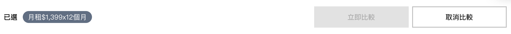

# CompareBar
資費比比看需要與 Modal 與 RadioCard 共用，主要流程如下：

1. 在 RadioCard 點選「資費比比看」
2. 頁面更新 state，顯示控制條，
3. 點選要比較的方案後，
4. 點選「立即比較」觸發跳窗 
5. Modal 顯示內容。
6. 點擊「取消比較」關閉跳窗



### Usage
```jsx
import CompareBar from '../components/CompareBar';

class Page extends React.Component {
  constructor(props) {
    super(props);
    
    this.state = {
      modalOpen: false,
      currentModal: {
        type: '',
        title: '',
        content: '',
      },
      form: {
        compare: { value: [] },
      }
    }
  }
  
  compareChange = (compare) => {
    this.setState({
      compare: compare,
    });
  };

  doCompare = () => {
    this.setState({
      modalOpen: true,
      currentModal: {
        type: 'compare',
        title: '資費比比看',
        compareList: this.state.form.compare.value,
      },
    });
  };

  render () {
    return (
      <main>
        <RadioCard
          name={flow.name}
          tags={flow.tags}
          options={flow.options}
          value={this.state.compare ? form.compare.value : form[flow.name].value}
          onChange={this.inputChange}
          modalOpen={this.openModal}
          hasCompare={true}
          isCompare={this.state.compare}
          onCompareChange={this.compareChange}
        />
        <CompareBar
          list={form.compare.value}
          open={this.state.compare}
          doCompare={this.doCompare}
          cancelCompare={this.cancelCompare}
        />

        <EstoreModal
          {...this.state.currentModal}
          open={this.state.modalOpen}
          onSubmit={(e, f) => this.modalSubmit(e, f)}
          onConfirm={(e, f) => this.modalConfirm(e, f)}
          onCancel={(e, f) => this.modalCancel(e, f)}
          onClose={(e, f) => this.modalClose(e, f)}
        />
      </main>
    )
  }
}
```
### Source
```jsx
import React from 'react';
import Formsy from 'formsy-react';
import Button from './Button';
import Tooltip from './Tooltip';
import NumberSelector from './form/NumberSelector';
import PropTypes from 'prop-types';
import formatNumber from '../utils/numberFormatter';

import { setCartData, removeCartData, updateCartData } from '../stores/action';
import { bindActionCreators } from 'redux';
import { connect } from 'react-redux';

import { setMobile } from './util';

class CompareBar extends React.Component {
  constructor(props) {
    super(props);
    this.compareBar = React.createRef();
    this.scrollTimeout = false;
    this.state = {
      fixBottom: 0,
      compareList: this.props.list,
    };
  }

  componentDidMount = () => {
    if (typeof window !== 'undefined') {
      window.addEventListener('resize', (e) => setMobile(this));
      window.addEventListener('scroll', this.setPosition);
      window.addEventListener('mousewheel', this.setPosition);
    }
  };

  componentWillUnmount = () => {
    window.removeEventListener('resize', (e) => setMobile(this));
    window.removeEventListener('scroll', this.setPosition);
    window.removeEventListener('mousewheel', this.setPosition);
  };

  setPosition = () => {
    if (typeof window === 'undefined') return;

    if (!document.getElementsByTagName('footer').length) {
      return;
    }

    clearTimeout(this.scrollTimeout);

    let footer =
      document.body.clientHeight - document.getElementsByTagName('footer')[0].clientHeight - window.innerHeight;
    let scrollY = window.scrollY || document.documentElement.scrollTop;

    this.setState({
      fixBottom: scrollY > 0 && scrollY > footer && this.props.open ? scrollY - footer : 0,
    });
  };

  toggleDetail = () => {
    if (!this.state.detailOpen === true) {
      document.getElementsByTagName('html')[0].classList.add('cart-open');
    } else {
      document.getElementsByTagName('html')[0].classList.remove('cart-open');
    }
    this.setState({
      detailOpen: !this.state.detailOpen,
    });
  };

  render() {
    return (
      <div
        ref={this.compareBar}
        className={`fui-compare-bar ${this.props.open ? 'is-open' : ''}`}
        style={{ transform: `translateY(-${this.state.fixBottom}px)` }}>
        <div className='fui-container'>
          <div className='fui-compare-item'>
            <span className='compare-label'>已選</span>
            <span className='compare-item d-inline-block d-md-none'>{this.props.list.length}</span>
            {this.props.list.map((item, i) => (
              <span className='compare-item d-none d-md-inline-block' key={`fui-compare-item-${i}`}>
                {item}
              </span>
            ))}
          </div>
          <div className='fui-compare-action'>
            <Button
              btnStyle='primary'
              size='large'
              onClick={this.props.doCompare}
              disabled={this.props.list.length <= 1}>
              立即比較
            </Button>
            <Button btnStyle='secondary' size='large' onClick={this.props.cancelCompare}>
              取消比較
            </Button>
          </div>
        </div>
      </div>
    );
  }
}

CompareBar.propTypes = {
  list: PropTypes.array,
  open: PropTypes.bool,
  doCompare: PropTypes.func,
  cancelCompare: PropTypes.func,
};

export default CompareBar;
```


### Properties
| 名稱 | 屬性 | 必填 | 選項 | 說明 |
| :--- | :--- | :--- | :--- | :--- |
| list | Array | true |  | 從 RadioCard 透過 props 傳入要比較的資料 |
| open | Boolean | true |  | 是否要顯示控制條，預設為 false |
| doCompare | Function | true |  | 呼叫頁面顯示比較內容 |
| cancelCompare | Function | true |  | 取消比較，清空內容 |
