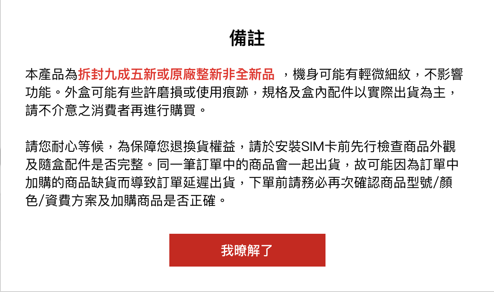
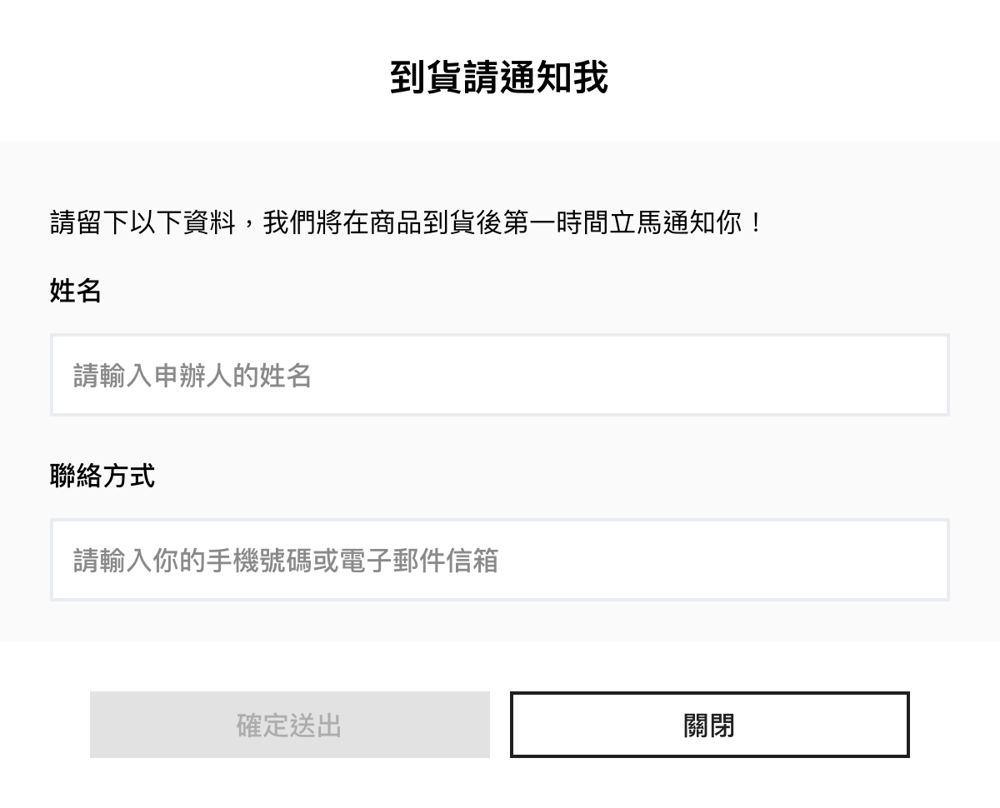
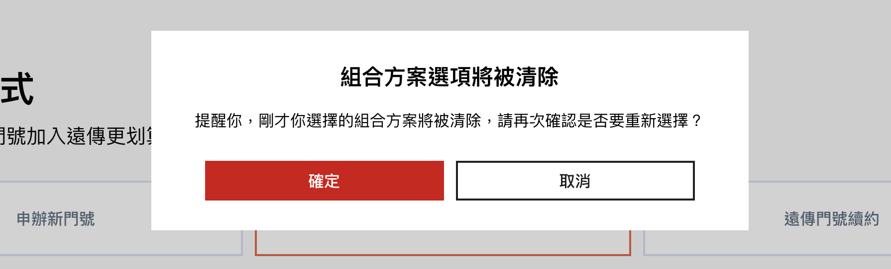

# EstoreModal

Estore Modal 根據不同狀態名稱顯示不同的內容，盡可能以共用的形式呈現。在 EstoreModal 中若有表單內容，表單按鈕的 disable 及 enable 改變則由對應的 function 處理。

熟悉跳窗機制後，可根據需要自行新增或修改跳窗訊息。


**提示訊息格式**


**表單格式**


**確認訊息格式**


### Usage
```jsx
import EstoreModal from '../components/EstoreModal';

class Page extends React.Component {
  constructor(props) {
    super(props);

    this.state = {
      currentModal: {
        type: 'notice',
        title: '',
        content: '',
      },
    }
  }


  modalSubmit = (type, form) => {
    console.info('MODAL SUBMIT', type, form);

    this.setState({
      modalOpen: false,
    });

    if (type === 'otpForm') {
      this.identityCheck();
    }
    // 貨到通知送出
  };

  modalConfirm = (type, form) => {
    console.info('MODAL SUBMIT', type, form);
    if (type === 'change-alert') {
      this.resetFormset();
    }
    if (type === 'phoneCheck-alert') {
      // this.phoneCheck();
    }
    if (type === 'identityCheck-alert') {
      // this.identityCheck();
    }
    this.setState({
      modalOpen: false,
    });
    // 貨到通知送出
  };

  modalCancel = (type) => {
    // 預約取貨送出
    console.info('MODAL CANCEL', type);
    if (type === 'change-alert') {
      this.canscelSelect();
    }
    this.setState({
      modalOpen: false,
    });
  };

  modalClose = (type) => {
    // 預約取貨送出
    console.info('MODAL CLOSE', type);
    this.setState({
      modalOpen: false,
    });
  };


  render () {
    return (
      <EstoreModal
        {...this.state.currentModal}
        open={this.state.modalOpen}
        onSubmit={this.modalSubmit}
        onConfirm={this.modalConfirm}
        onCancel={this.modalCancel}
        onClose={this.modalClose}
      />
    )
  }
}
```

### Sources
```jsx
import React from 'react';
import Modal from 'react-modal';
import Formsy from 'formsy-react';

import Button from './Button';
import LabelInput from './form/LabelInput';
import TextInput from './form/TextInput';
import RadioButtons from './form/RadioButtons';
import PlanTable from './partials/PlanTable';

import PropTypes from 'prop-types';
import * as Validation from '../utils/validation';
import * as Compare from '../mock/CompareData';

let countdownTimeout = null;

class EstoreModal extends React.Component {
  constructor(props) {
    super(props);
    this.state = {
      // reservationForm
      resend: false,
      currentHover: -1,
      countdown: 600,
      countdownTimeout: 600,
      modalOpen: this.props.open || false,
      combinebillSubmit: false,
      deliveryFormWithPlan: this.props.deliveryFormWithPlan || false,
      combinebillForm: {
        scid: { value: '', required: true },
        id_number: { value: '', required: true },
      },
      activityFormSubmit: false,
      activityForm: {
        valid_number: { value: '', required: true },
        serial_number: { value: '', required: true },
      },
      preregSubmit: false,
      searchPreRegForm: {
        scid: { value: '', required: true },
        id_number: { value: '', required: true },
        recapcha: { value: '', required: true },
      },
      reservationSubmit: false,
      reservationForm: {
        reserve_no: { value: '', required: true },
        id_number: { value: '', required: true },
      },
      // deliveryForm
      deliveryFormSubmit: false,
      deliveryForm: {
        type: { value: '' },
        name: { value: '', required: true },
        contact: { value: '', required: true },
      },
      otpFormSubmit: false,
      otpForm: {
        otp_number: { value: '' },
      },
    };
  }

  componentDidUpdate(prevProps, prevState) {
    if (prevProps.open !== this.props.open) {
      this.setState({
        deliveryFormWithPlan: this.props.deliveryFormWithPlan || false,
        modalOpen: this.props.open,
      });

      if (this.props.open && this.props.type === 'otpForm') {
        this.doCountDown();
      }
    }
  }

  resetCountdown = () => {
    // API 重新發送簡訊
    this.setState({
      resend: true,
      countdown: 600,
    });
    this.doCountDown();
  };

  doCountDown = () => {
    // 輸入驗證碼倒數功能
    countdownTimeout = setInterval(() => {
      if (this.state.countdown - 1 >= 0) {
        this.setState({
          countdown: this.state.countdown - 1,
        });
      } else {
        clearInterval(countdownTimeout);
      }
    }, 1000);
  };

  inputChange = (name, value) => {
    // 統一處理表單更新
    let type = this.props.type;
    const newForm = Object.assign(this.state[type]);

    newForm[name].value = value;

    this.setState({
      [type]: newForm,
    });
  };

  enableComninebillButton = () => {
    this.setState({
      combinebillSubmit: true,
    });
  };

  disableComninebillButton = () => {
    this.setState({
      combinebillSubmit: false,
    });
  };

  enablePreRegButton = () => {
    this.setState({
      preregSubmit: true,
    });
  };

  disablePreRegButton = () => {
    this.setState({
      preregSubmit: false,
    });
  };

  searchPreRegForm = () => {
    const { searchPreRegForm } = this.state;
    // 搜尋預約登陸表單
  };

  combinebillForm = () => {
    const { combinebillForm } = this.state;
    // 合併帳單表單
  };

  setHover = (index) => {
    // 資費比較 hover 效果
    this.setState({
      currentHover: index,
    });
  };

  renderModalTitle = () => {
    // 產生跳窗標題
    return this.props.title ? (
      <div className='fui-modal-head'>
        <h5>{this.props.title}</h5>
      </div>
    ) : null;
  };
  // ReservationForm start
  enableReservationButton = () => {
    this.setState({
      reservationSubmit: true,
    });
  };

  disableReservationButton = () => {
    this.setState({
      reservationSubmit: false,
    });
  };

  reservationForm = () => {
    const { reservationForm } = this.state;
    ...
  };
  // ReservationForm end
  /** ---- */
  // Delivery Form start
  enableDeliveryButton = () => {
    this.setState({
      deliverySubmit: true,
    });
  };

  disableDeliveryButton = () => {
    this.setState({
      deliverySubmit: false,
    });
  };

  deliveryForm = () => {
    const { deliveryForm } = this.state;
    ...
  };
  // Delivery Form end
  enableActivityForm = () => {
    this.setState({
      activityFormSubmit: true,
    });
  };

  disableActivityForm = () => {
    this.setState({
      activityFormSubmit: false,
    });
  };

  activityForm = () => {
    const { activityForm } = this.state;
    ...
  };

  enableOtpButton = () => {
    this.setState({
      otpFormSubmit: true,
    });
  };

  disableOtpButton = () => {
    this.setState({
      otpFormSubmit: false,
    });
  };

  otpValidationForm = () => {
     // opt 驗證表單，會使用 doCountDown() 顯示倒數狀況
  };

  alertContent = () => {
    // 顯示資費比較內容
    ...
  };

  renderCompare = () => {
    // 顯示資費比較內容
  };

  renderTable = (obj) => {
    // 顯示表格
  };

  renderList = (list) => {
    // 顯示列表
  };

  renderContent = () => {
    // 根據傳入的資料顯示內容
    // renderList() 顯示列表
    // renderTable() 顯示表格
  };

  noticeContent = () => {
    // 提示說明，
    // renderContent() 產生內容
  };

  secondCard = () => {
    // 第二證件說明
  };

  iframeContent = () => {
    // 顯示 iframe 內容
  };

  render() {
    const { type } = this.props;

    return (
      <Modal
        onAfterOpen={(e) => document.getElementsByTagName('html')[0].classList.add('modal-open')}
        onAfterClose={(e) => document.getElementsByTagName('html')[0].classList.remove('modal-open')}
        isOpen={this.props.open}
        contentLabel='Example Modal'
        className={
          this.props.type.indexOf('alert') > -1 || this.props.type.indexOf('Alert') > -1
            ? 'fui-alert-modal'
            : this.props.type.indexOf('form') > -1 || this.props.type.indexOf('Form') > -1
            ? 'fui-form-modal'
            : this.props.type === 'iframe'
            ? 'fui-iframe-modal'
            : 'fui-notice-modal'
        }>
        {type === 'compare' ? this.renderCompare() : null}
        {type === 'secondCard' ? this.secondCard() : null}
        {type === 'activityForm' ? this.activityForm() : null}
        {type === 'searchPreRegForm' ? this.searchPreRegForm() : null}
        {type === 'combinebillForm' ? this.combinebillForm() : null}
        {type === 'reservationForm' ? this.reservationForm() : null}
        {type === 'otpForm' ? this.otpValidationForm() : null}
        {type === 'deliveryForm' ? this.deliveryForm() : null}
        {this.props.type.indexOf('alert') > -1 || this.props.type.indexOf('Alert') > -1 ? this.alertContent() : null}
        {type === 'notice' ? this.noticeContent() : null}
        {type === 'iframe' ? this.iframeContent() : null}
        {type === 'secondCardModal' ? this.secondCard() : null}
      </Modal>
    );
  }
}

EstoreModal.propTypes = {
  type: PropTypes.string.isRequired,
  open: PropTypes.bool,
  title: PropTypes.string,
  deliveryFormWithPlan: PropTypes.bool, // when type = deliveryForm, set true or false
  content: PropTypes.any,
  submitText: PropTypes.string,
  onSubmit: PropTypes.func,
  confirmText: PropTypes.string,
  onConfirm: PropTypes.func,
  cancelText: PropTypes.string,
  onCancel: PropTypes.func,
  closeText: PropTypes.string,
  onClose: PropTypes.func,
};

export default EstoreModal;
```

### Properties
| 名稱 | 屬性 | 必填 | 選項 | 說明 |
| :--- | :--- | :--- | :--- | :--- |
| type | String | true |  | 要顯示的 Modal 類型<br/>目前已有 **compare** \| **secondCard** \| **activityForm** \| **searchPreRegForm** \| **combinebillForm** \| **reservationForm** \| **otpForm** \| **deliveryForm** \| **alert** \| **notice** \| **iframe** 等 11 種類型 |
| open | Boolean | true |  | 跳窗顯示狀態，預設為 false |
| title | String | true |  | 標題 |
| deliveryFormWithPlan | Boolean |  |  | 用於商品到貨通知表單 `deliveryForm`，若為 true，需選擇申辦方式  |
| content | Any |  |  | 跳窗內容，可根據各個範例資料帶入需喲啊的格式 | 
| submitText | String |  |  | 表單送出文字 |
| onSubmit | Function |  |  | 送出表單內容 |
| confirmText | String |  |  | 確認文字，用於確認或取消狀態，多用於 `alert` |
| onConfirm | Function |  |  | 送出確認修改 |
| cancelText | String |  |  | 取消文字 |
| onCancel | Function |  |  | 送出取消修改 |
| closeText | String |  |  | 關閉文字 |
| onClose | Function |  |  | 送出關閉指令 |