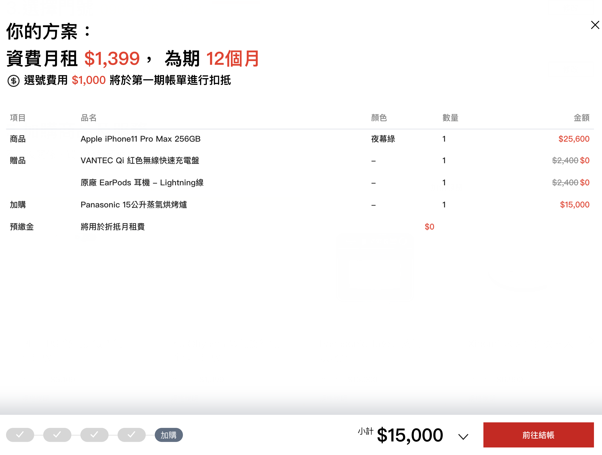

# FlowCart
申辦流程購物車較為複雜使用上需要與表單內容與購物車資料連動，並更新到 Redux 中。



# Usage
```jsx
import { setFlowCartData, trackPageViewStart } from '../../stores/action';
import Cart from '../../components/FlowCart';

class Page extends React.Component {
  constructor(props) {
    super(props);
    this.state = {
      canEdit: true,
      cartUpdate: false,
      originFlow: Mock.planStep,
      applyFlow: [...Mock.planStep, ...Mock.newFlow],
      form: {
        color: { value: Mock.Product.colors[0].value, required: true },
        with_plan: { value: window.location.hash === '#device-alone' ? '0' : '1', required: true },
        input_validation: { value: '', required: true },
        id_number: { value: '', required: true },
        scid: { value: '', required: true },
        apply_method: { value: '' },
        number: { value: 1, required: true },
        plan: { value: '', required: true },
        phone_number: { value: '', required: true },
        gift: { value: '', required: true },
        extra_product: { value: '', required: true },
        extra_plan: { value: '', required: true },
      },
      cart: {
        apply_method: '',
        plan: null,
        product: null,
        identity_validation: null,
        input_validation: null,
        phone_number: null,
        gift: [],
        extra_product: [],
        extra_plan: [],
      },
      step: 0,
      editStep: -1,
    }
  }
  render () {
    return (
      <Cart
        canRollback={true}
        afterUpdate={(e) => this.setState({ cartUpdate: false })}
        update={this.state.cartUpdate}
        steps={this.state.applyFlow}
        currentStep={this.state.step}
        openStep={this.state.editStep === -1 ? this.state.step : this.state.editStep}
        product={{ ...this.state.productInfo, color: form.color.value, number: form.number.value }}
        cart={this.state.cart}
        submit={(e) => this.submit(e)}
        stepChange={(e) => this.stepChange(e)}
        editStep={(e) => this.changeFormSection(e)}
      />
    )
  }
}

const mapStateToProps = (state) => {
  return {
    analyticsInitialState: state.analyticsInitialState, // 可加可不加
    flowCart: state.flowCartReducer,
  };
};

const mapDispatchToProps = (dispatch) =>
  bindActionCreators(
    {
      trackPageViewStart,
      setFlowCartData,
    },
    dispatch
  );

export default withRouter(connect(mapStateToProps, mapDispatchToProps)(Page));
```

### Source
```jsx
import React from 'react';
import Button from './Button';
import PropTypes from 'prop-types';
import { setFlowCartData } from '../stores/action';
import { bindActionCreators } from 'redux';
import { connect } from 'react-redux';

import formatNumber from '../utils/numberFormatter';
import { setMobile } from './util';

class FlowCart extends React.Component {
  constructor(props) {
    super(props);
    this.cart = React.createRef();

    this.scrollTimeout = false;
    this.state = {
      isMobile: window.innerWidth < 768,
      detailOpen: false,
      total: 0,
      fixBottom: 0,
      currentCart: null,
    };
  }

  componentDidMount = () => {
    if (typeof window !== 'undefined') {
      window.addEventListener('resize', (e) => setMobile(this));
      window.addEventListener('scroll', this.setPosition);
      window.addEventListener('mousewheel', this.setPosition);
    }
  };

  componentWillUnmount = () => {
    window.removeEventListener('resize', (e) => setMobile(this));
    window.removeEventListener('scroll', this.setPosition);
    window.removeEventListener('mousewheel', this.setPosition);
  };

  componentDidUpdate = (prevProps) => {
    // 根據 HTML 頁面內容給予對應的樣式
    if (document.getElementsByClassName('fui-section-collapse').length) {
      if (this.props.currentStep === 0 && !this.hasCartData()) {
        document.getElementsByClassName('fui-section-collapse')[0].classList.remove('with-cart');
      } else {
        document.getElementsByClassName('fui-section-collapse')[0].classList.add('with-cart');
      }
    }

    // 判斷資料是否異動
    if (
      this.props.cart !== prevProps.cart ||
      (this.props.cart.extra_plan && this.props.cart.extra_plan.length !== prevProps.cart.extra_plan.length) ||
      this.props.update !== prevProps.update ||
      this.props.valid !== prevProps.valid ||
      (this.props.cart.extra_product && this.props.cart.extra_product.length !== prevProps.cart.extra_product.length) ||
      this.props.currentStep !== prevProps.currentStep
    ) {
      this.setState({
        total: 0,
        currentCart: this.props.steps[this.props.currentStep]
          ? this.props.cart[this.props.steps[this.props.currentStep].name]
          : null,
      });

      this.setPosition();
      this.countAmount();

      this.props.afterUpdate();
    }
  };

  toggleDetail = () => {
    // 切換明細的開闔
    if (!this.state.detailOpen === true) {
      document.getElementsByTagName('html')[0].classList.add('cart-open');
    } else {
      document.getElementsByTagName('html')[0].classList.remove('cart-open');
    }
    this.setState({
      detailOpen: !this.state.detailOpen,
    });
  };

  countAmount = () => {
    // 計算總額
    const { cart } = this.props;
    let total = 0;

    for (var i in cart) {
      if (cart[i]) {
        switch (i) {
          case 'plan':
            total = cart[i].prepay;
            break;

          case 'gift':
            if (cart[i].length) {
              let giftCount = cart[i].reduce((accr, val) => accr + val.productPrice, 0);
              total += giftCount;
            }
            break;

          case 'extra_product':
            if (cart[i].length) {
              let extraProductCount = cart[i].reduce((accr, val) => accr + val.productPrice * val.number, 0);
              total += extraProductCount;
            }
            break;

          case 'products':
            total += cart.products.combinePrice;
            break;

          case 'combine_1':
            total += cart.combine_1.combinePrice;
            break;

          case 'combine_2':
            total += cart.combine_2.combinePrice;
            break;
        }
      }
    }

    // console.log('countAmount:' + total);
    this.setState({
      total: total,
    });

    this.forceUpdate();
  };

  setPosition = () => {
    // 根據捲動控制位置
    if (typeof window === 'undefined' || (this.props.currentStep === 0 && !this.hasCartData())) return;

    if (!document.getElementsByTagName('footer').length || !this.cart.current) {
      return;
    }

    clearTimeout(this.scrollTimeout);
    let footDom = document.getElementsByTagName('footer')[0];
    let footer = document.body.clientHeight - footDom.clientHeight - window.innerHeight;
    let scrollY = window.scrollY || document.documentElement.scrollTop;

    this.setState({
      fixBottom: scrollY !== 0 && scrollY > footer ? scrollY - footer : 0,
    });

    this.forceUpdate();
  };

  backStep = (step, index) => {
    if (this.state.isMobile) return;
    if (index <= this.props.currentStep) this.props.editStep(index);
  };

  underMinLimit = () => {
    // 判斷資料數量是否小於數量
    const { steps, openStep } = this.props;
    const flow = this.props.steps[this.props.openStep].name;
    const currentCart = this.props.cart[flow];

    if (!steps[openStep].minLength) {
      return false;
    } else {
      return steps[openStep].minLength > currentCart.length;
    }
  };

  saveEditStep = () => {
    // 儲存修改的步驟
    const flow = this.props.steps[this.props.currentStep];
    const currentCart = this.props.cart[flow.name];
    let hasData = false;
    let underMinLimit = flow.minNumber && flow.minNumber > currentCart.length;

    if (
      (flow === 'identity_validation' &&
        currentCart &&
        currentCart.id_number !== '' &&
        currentCart.scid !== '' &&
        currentCart.isPass) ||
      (flow === 'input_validation' && currentCart && currentCart.phone_number !== '' && currentCart.isPass) ||
      (currentCart !== null && currentCart !== [] && currentCart !== '')
    ) {
      hasData = true;
    }

    this.props.stepChange(
      hasData && !underMinLimit && this.props.currentStep + 1 < this.props.steps.length
        ? this.props.currentStep + 1
        : this.props.currentStep
    );
  };

  hasCartData = (i, type) => {
    // 判斷是否有購物車資料
    const flow = this.props.steps[typeof i === 'number' ? i : this.props.openStep].name;
    const currentCart = this.props.cart[flow];

    if (flow === 'identity_validation') {
      return currentCart && currentCart.id_number !== '' && currentCart.scid !== '' && currentCart.isPass;
    } else if (flow === 'input_validation') {
      return currentCart && currentCart.phone_number !== '' && currentCart.isPass;
    } else {
      return currentCart !== null && currentCart !== [] && currentCart !== '';
    }
  };

  render() {
    const { cart, product, currentStep, openStep } = this.props;

    return (
      <div
        className={`fui-cart-bar ${this.props.currentStep === 0 && !this.hasCartData() ? 'is-hidden' : ''} ${
          this.state.detailOpen ? 'is-open' : ''
        }`}
        ref={this.cart}
        style={{ transform: `translateY(-${this.state.fixBottom}px)` }}>
        <div className='fui-cart-detail-container'>
          <div className='fui-cart-detail'>
            <div className='fui-container'>
              <div role='button' className='close' onClick={this.toggleDetail}>
                <i className='icon-close i-24'></i>
              </div>
            </div>
            <div className='fui-cart-detail-content'>
              <div className='fui-container'>
                {cart.plan ? (
                  <h2 className='my-0'>
                    你的方案：
                    <br />
                    資費月租 <span className='is-text-accent'>${formatNumber(cart.plan.price)}</span>， 為期{' '}
                    <span className='is-text-accent'>{cart.plan.month}個月</span>
                  </h2>
                ) : (
                  <h2 className='my-0'>{''}</h2>
                )}
                {cart.phone_number && cart.phone_number.price ? (
                  <h5 className='mt-0 phone-number-price'>
                    
                    選號費用 <span className='is-text-accent'>${formatNumber(cart.phone_number.price)}</span>{' '}
                    將於第一期帳單進行扣抵
                  </h5>
                ) : null}
                <table>
                  <thead>
                    <tr>
                      <th>項目</th>
                      <th>品名</th>
                      <th>顏色</th>
                      <th>數量</th>
                      <th className='align-right'>金額</th>
                    </tr>
                  </thead>
                  <tbody>
                    {product ? (
                      <tr data-row='項目'>
                        <td className='label'>商品</td>
                        <td>{product.name}</td>
                        <td>
                          {product.color ? <span class='d-inline-block d-md-none'>顏色：</span> : null}
                          <span>{product.color || '-'}</span>
                        </td>
                        <td>
                          {product.number ? <span class='d-inline-block d-md-none'>數量：</span> : null}
                          <span>{product.number || '-'}</span>
                        </td>
                        <td className='align-right'>
                          <span className='is-text-accent'>
                            ${formatNumber(product.projectPrice || product.productPrice)}
                          </span>
                        </td>
                      </tr>
                    ) : null}
                    {cart.product && cart.product.length ? (
                      <tr data-row='項目'>
                        <td className='label'>商品</td>
                        <td>{cart.product.name}</td>
                        <td>
                          {cart.product.color ? <span class='d-inline-block d-md-none'>顏色：</span> : null}
                          <span>{cart.product.color || '-'}</span>
                        </td>
                        <td>
                          {cart.product.number ? <span class='d-inline-block d-md-none'>數量：</span> : null}
                          <span>{cart.product.number || '-'}</span>
                        </td>
                        <td className='align-right'>
                          <span className='is-text-accent'>
                            ${formatNumber(cart.product.projectPrice || cart.product.productPrice)}
                          </span>
                        </td>
                      </tr>
                    ) : null}
                    {cart.products ? (
                      <tr data-row='項目'>
                        <td className='label'>商品</td>
                        <td>{cart.products.name || cart.products.title}</td>
                        <td>
                          {cart.product.color ? <span class='d-inline-block d-md-none'>顏色：</span> : null}
                          <span>{cart.products.color || '-'}</span>
                        </td>
                        <td>
                          {cart.product.number ? <span class='d-inline-block d-md-none'>數量：</span> : null}
                          <span>{cart.products.number || '-'}</span>
                        </td>
                        <td className='align-right'>
                          <span className='is-text-accent'>
                            ${formatNumber(cart.products.combinePrice || cart.products.productPrice)}
                          </span>
                        </td>
                      </tr>
                    ) : null}
                    {cart.combine_1 ? (
                      <tr data-row='項目'>
                        <td className='label'>組合商品一</td>
                        <td>{cart.combine_1.name}</td>
                        <td>
                          {cart.combine_1.color ? <span class='d-inline-block d-md-none'>顏色：</span> : null}
                          <span>{cart.combine_1.color || '-'}</span>
                        </td>
                        <td>
                          {cart.combine_1.number ? <span class='d-inline-block d-md-none'>數量：</span> : null}
                          <span>{cart.combine_1.number || '-'}</span>
                        </td>
                        <td className='align-right'>
                          <span className='is-text-accent'>
                            ${formatNumber(cart.combine_1.combinePrice || cart.combine_1.productPrice)}
                          </span>
                        </td>
                      </tr>
                    ) : null}
                    {cart.combine_2 ? (
                      <tr data-row='項目'>
                        <td className='label'>組合商品二</td>
                        <td>{cart.combine_2.name}</td>
                        <td>
                          {cart.combine_2.color ? <span class='d-inline-block d-md-none'>顏色：</span> : null}
                          <span>{cart.combine_2.color || '-'}</span>
                        </td>
                        <td>
                          {cart.combine_2.number ? <span class='d-inline-block d-md-none'>數量：</span> : null}
                          <span>{cart.combine_2.number || '-'}</span>
                        </td>
                        <td className='align-right'>
                          <span className='is-text-accent'>
                            ${formatNumber(cart.combine_2.combinePrice || cart.combine_2.productPrice)}
                          </span>
                        </td>
                      </tr>
                    ) : null}
                    {cart.gift && cart.gift.length
                      ? cart.gift.map((gift, i) => (
                          <tr data-row='贈品' key={`cart-gift-${i}`}>
                            {i === 0 ? (
                              <td className='label' rowSpan={cart.gift.length}>
                                贈品
                              </td>
                            ) : null}
                            <td>{gift.name}</td>
                            <td className='color'>
                              {gift.color ? <span class='d-inline-block d-md-none'>顏色：</span> : null}
                              <span>{gift.color || '-'}</span>
                            </td>
                            <td className='number'>
                              <span class='d-inline-block d-md-none'>數量：</span>
                              <span>{gift.number || 1}</span>
                            </td>
                            <td className='align-right'>
                              {gift.originPrice ? <del>${formatNumber(gift.originPrice)}</del> : null}
                              <span className='is-text-accent'>${formatNumber(gift.productPrice)}</span>
                            </td>
                          </tr>
                        ))
                      : null}
                    {cart.extra_product && cart.extra_product.length
                      ? cart.extra_product.map((prod, i) => (
                          <tr data-row='加購' key={`cart-extra-product-${i}`}>
                            {i === 0 ? (
                              <td className='label' rowSpan={cart.extra_product.length}>
                                加購
                              </td>
                            ) : null}
                            <td>{prod.name}</td>
                            <td className='color'>
                              {prod.color ? <span class='d-inline-block d-md-none'>顏色：</span> : null}
                              <span>{prod.color || '-'}</span>
                            </td>
                            <td className='number'>
                              {prod.number ? <span class='d-inline-block d-md-none'>數量：</span> : null}
                              <span>{prod.number || '-'}</span>
                            </td>
                            <td className='align-right'>
                              {prod.originPrice ? <del>${formatNumber(prod.originPrice)}</del> : null}
                              <span className='is-text-accent'>${formatNumber(prod.productPrice)}</span>
                            </td>
                          </tr>
                        ))
                      : null}
                    {cart.extra_plan && cart.extra_plan.length
                      ? cart.extra_plan.map((plan, i) => (
                          <tr data-row='加值服務' key={`cart-extra-plan-${i}`}>
                            {i === 0 ? (
                              <td className='label' rowSpan={cart.extra_plan.length}>
                                加值服務
                              </td>
                            ) : null}
                            <td>{plan.name}</td>
                            <td className='color'>-</td>
                            <td className='number'>-</td>
                            <td className='align-right'>
                              {plan.originPrice ? <del>${formatNumber(plan.originPrice)}</del> : null}
                              <span className='is-text-accent'>${formatNumber(plan.productPrice)}</span>
                            </td>
                          </tr>
                        ))
                      : null}
                    {cart.plan ? (
                      <tr data-row='預繳金'>
                        <td className='label'>預繳金</td>
                        <td colpsan='2'>將用於折抵月租費</td>
                        <td className='align-right'>
                          <span className='is-text-accent'>${formatNumber(cart.plan.prepay)}</span>
                        </td>
                      </tr>
                    ) : null}
                  </tbody>
                </table>

                {this.state.isMobile ? (
                  <div className='fui-cart-count-list'>
                    <div className='count-item'>
                      <div>全館滿$3,000折$20</div>
                      <div className='price'>-$200</div>
                    </div>
                    <div className='count-item amount'>
                      <div>小計</div>
                      <div className='price'>$15,150</div>
                    </div>
                  </div>
                ) : null}
              </div>
            </div>
          </div>
        </div>
        <div className='fui-cart-preview'>
          <div className='fui-container'>
            <div className='fui-cart-container'>
              <div className='column'>
                <div className='fui-steps'>
                  {this.props.steps.map((step, i) => (
                    <div
                      key={`cart-step-${i}`}
                      role={this.state.isMobile ? 'text' : 'button'}
                      onClick={(e) => this.backStep(step, i)}
                      data-index={i}
                      data-step={currentStep}
                      className={`fui-step-item ${openStep === i ? 'is-active' : ''} ${
                        currentStep >= i && this.hasCartData(i, 'step') ? 'is-done' : ''
                      }`}>
                      <span className='text'>{step.slug}</span>
                      {currentStep >= i && this.hasCartData(i, 'step') ? (
                        <span className='icon'>
                          <i className='icon-check'></i>
                        </span>
                      ) : null}
                    </div>
                  ))}
                </div>
                {this.props.steps[this.props.currentStep].name !== 'apply_method' ? (
                  <div className='fui-cart-amount'>
                    <div>小計</div>
                    <div role='button' onClick={this.toggleDetail}>
                      <h2 className='price'>${formatNumber(this.state.total)}</h2>
                      <i>
                        
                      </i>
                    </div>
                  </div>
                ) : null}
              </div>
              <div className='column'>
                {currentStep === openStep && currentStep + 1 >= this.props.steps.length ? (
                  <Button
                    btnStyle='primary'
                    size='large'
                    onClick={this.props.submit}
                    disabled={!this.hasCartData() || this.underMinLimit()}>
                    前往結帳
                  </Button>
                ) : openStep !== currentStep ? (
                  <Button
                    btnStyle='primary'
                    size='large'
                    onClick={this.saveEditStep}
                    disabled={!this.hasCartData() || this.underMinLimit()}>
                    修改完成
                  </Button>
                ) : (
                  <Button
                    btnStyle='primary'
                    size='large'
                    onClick={(e) => this.props.stepChange(currentStep + 1)}
                    disabled={!this.hasCartData() || this.underMinLimit()}>
                    {`下一步：` + this.props.steps[currentStep + 1].slug}
                  </Button>
                )}
              </div>
            </div>
          </div>
        </div>
      </div>
    );
  }
}

FlowCart.propTypes = {
  steps: PropTypes.arrayOf(
    PropTypes.shape({
      text: PropTypes.string,
    })
  ),
  afterUpdate: PropTypes.func,
  canRollback: PropTypes.bool,
  valid: PropTypes.bool,
  update: PropTypes.bool,
  currentStep: PropTypes.number,
  openStep: PropTypes.number,
  product: PropTypes.object,
  cart: PropTypes.any,
  next: PropTypes.string,
  stepChange: PropTypes.func,
  editStep: PropTypes.func,
};

const mapStateToProps = (state) => {
  return {
    flowCart: state.flowCartReducer,
  };
};

const mapDispatchToProps = (dispatch) =>
  bindActionCreators(
    {
      setFlowCartData,
    },
    dispatch
  );

export default connect(mapStateToProps, mapDispatchToProps)(FlowCart);

```

### Properties
| 名稱 | 屬性 | 必填 | 選項 | 說明 |
| :--- | :--- | :--- | :--- | :--- |
| onUpdate | Function | true |  | 購物車內容更新 |
| afterUpdate | Function | true |  | 購物車內容更新完，回傳通知給頁面執行下一步動作 |
| valid | Boolean |  |  | 是否可進入結帳流程 |
| update | Boolean |  |  | 避免 React 偵測不出購物車內容改變，提供 componentDidUpdate 判斷資料是否有更新 |
| currentStep | Number |  |  | 紀錄目前的所有步驟 |
| openStep | Number |  |  | 所在的步驟 |
| editStep | Function |  |  | 回傳要編輯的步驟 |
| stepChange | Function |  |  | 回傳前往下一步或回到前面的步驟 |
| cart | Any |  |  | 購物車資料 |
| next | String |  |  | 前往下一步的文字 |
| submit | Function |  |  | 前往下一步 |