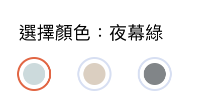

#ColorSelector
用於產品頁選擇顏色



### 用法
```jsx
import ColorSelector from '../../components/form/ColorSelector';

class Product extends React.Component {
  constructor(props) {
    super(props);

    this.state = {
      productInfo: {
        colors: [
          {
            label: '夜幕綠',
            value: '夜幕綠',
            color: 'rgb(201, 219, 221)',
          },
          {
            label: '土豪金',
            value: '土豪金',
            color: 'rgb(220, 207, 191)',
          },
          {
            label: '太空灰',
            value: '太空灰',
            color: 'rgb(128, 133, 136)',
          },
        ],
      },
      form: {
        color: { value: Mock.Product.colors[0].value, required: true },
      }
    }
  }

  render() {
    return (
      <ColorSelector
        required={true}
        name='color'
        options={productInfo.colors}
        value={form.color.value}
        onChange={this.inputChange}
      />
    )
  }
}
```

### Sources
```jsx
import React from 'react';
import { withFormsy } from 'formsy-react';
import PropTypes from 'prop-types';

class ColorSelector extends React.Component {
  constructor(props) {
    super(props);
    this.state = {
      submitted: false,
      isInvalid: false,
      options: this.props.options,
      selected: { label: '', value: '' },
    };
  }

  componentDidMount() {
    this.props.setValue(this.props.value);
    this.setState({
      selected: this.setSelected(this.props.value),
    });
  }

  componentDidUpdate(nextProps) {
    if (this.props.getValue() !== this.state.selected.value) {
      this.props.setValue(this.props.value);
      this.setState({
        selected: this.setSelected(this.props.value),
      });
    }
    if (this.props.isFormSubmitted() !== this.state.submitted) {
      this.setState({
        submitted: this.props.isFormSubmitted(),
        isInvalid: this.props.showError(),
      });
    }
  }

  setSelected = (value) => {
    return this.props.options.filter((opt, i) => opt.value === value)[0];
  };

  handleChange = (event) => {
    this.setState({
      selected: this.setSelected(event.currentTarget.value),
    });
    this.props.setValue(event.currentTarget.value);
    this.props.onChange(this.props.name, event.currentTarget.value);
    this.setState({
      isInvalid: this.props.showError(),
    });
  };

  renderOptions = () =>
    this.props.options.map((option, i) => (
      <label className='fui-color-selector-item' key={`fui-color-selector-item-${i}`}>
        <input
          type='radio'
          value={option.value}
          checked={option.value === this.state.selected.value}
          name={this.props.name}
          onChange={this.handleChange}
        />
        <div
          className='color-item'
          style={{
            background: option.color,
          }}></div>
      </label>
    ));

  render() {
    return (
      <div className={`fui-color-selector-container ${this.props.className || ''}`}>
        <div className='body1'>選擇顏色：{this.state.selected.label}</div>
        <div className='fui-color-selector-items'>{this.renderOptions()}</div>
      </div>
    );
  }
}

ColorSelector.propTypes = {
  required: PropTypes.bool,
  name: PropTypes.string.isRequired,
  value: PropTypes.string,
  className: PropTypes.string,
  options: PropTypes.arrayOf(
    PropTypes.shape({
      color: PropTypes.string.isRequired,
      value: PropTypes.string.isRequired,
      label: PropTypes.string.isRequired,
    })
  ),
  onChange: PropTypes.func,
};

export default withFormsy(ColorSelector);

```

### Properties

| 名稱 | 屬性 | 必填 | 選項 | 說明 |
| :--- | :--- | :--- | :--- | :--- |
| name | String | true |  | 輸入框名稱 |
| value | String | true |  | 值 |
| required | Boolean |  |  | 是否為必填 |
| className | String |  |  | 樣式 |
| options | Array |  |  | {<br/>color: 色碼, <br/>value: 值,<br/> label: 顏色說明<br/>} |
| onChange | Function | true |  | 選取異動回傳 |

