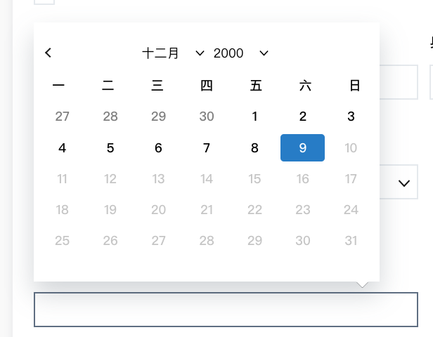

# DatePicker

DatePicker 使用 `react-datepicker`，可使用 props 請參照官方[文件](https://www.npmjs.com/package/react-datepicker)



## Usage
```jsx
import DatePicker from 'react-datepicker';
import TW from 'date-fns/locale/zh-TW';

class Form extends React.Component {
  constructor(props) {
    super(props);
    this.selector = React.createRef();
    this.state = {
      maxDate: [dt.getFullYear(), dt.getMonth() + 1, dt.getDate()],
    };
  }

  render() {
    return (
      <DatePicker
        maxDate={new Date(this.state.maxDate[0] - 20, this.state.maxDate[1], this.state.maxDate[2])}
        yearDropdownItemNumber={50}
        showYearDropdown={true}
        showMonthDropdown={true}
        dateFormat='yyyy/MM/dd'
        locale={TW}
        disabled={this.state.isMemberData}
        required={basicInfoForm.birthday.required}
        placeholder='輸入出生年月日'
        selected={basicInfoForm.birthday.value}
        onChange={(date) => this.basicFormChange('birthday', date)}
        onBlur={(e) => this.setState({ datepickerUpdate: true })}
      />
    );
  }
}

```
