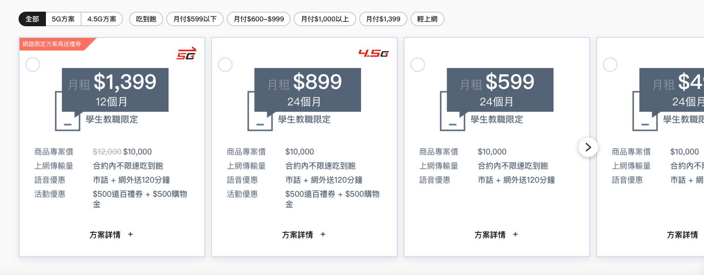

# RadioCard
申辦流程的資費牌卡，可用標籤做 filter，與資費比較



### Usage
```jsx
import RadioCard from '../components/form/RadioCard';
import CompareBar from '../components/CompareBar';

class Product extends React.Component {
  constructor (props) {
    super(props);

    this.state = {
      compare: true || false,
      form: {
        compare: { value: [] },
        plan: { value: '', required: true },
      },
      flow: {
        id: 'plan-select',
        slug: '資費',
        title: '資費方案',
        name: 'plan',
        description: '吃到飽吃不飽這裡都有',
        type: 'radio-card',
        tags: {
          name: '資費分類',
          list: [
            // '全部',
            '5G方案',
            ...
          ],
        },
        options: [
          {
            ribbon: '網路限定方案再送禮券',
            value: '月租$1,399x12個月',
            sticker: '/resources/cbu/estore/5-g.png',
            unit: '月租',
            price: 1399,
            prepay: 0,
            month: '12',
            note: '學生教職限定',
            list: [
              { title: '商品專案價', text: `<del>$12,000</del><span>$10,000</span>` },
              { title: '上網傳輸量', text: `合約內不限速吃到飽` },
              { title: '語音優惠', text: `市話 + 網外送120分鐘` },
              { title: '活動優惠', text: `$500遠百禮券 + $500購物金` },
            ],
            tag: ['5G方案', ...],
            modal: {
              title: '$1,399/12個月 方案詳情',
              content: `
                <h5 class='mb-1'>合約說明</h5>
                <p>1. 設備補貼款 $10000 元。實際應繳之補貼款以合約未到期之“日”為單位，按合約總日數比例計算。合約未到期之日數自解約當日起算，計算公式：專案補貼款 x(合約未到期日數／合約總日數)=實際應繳專案補貼款（四捨五入計算至整數）。</p>
                <p>2. 電信補貼款 $10000元，電信優惠補貼款以實際已享贈送傳輸量補貼優惠(每月電信優惠補貼款優惠)X(合約未到期日數／合約約定日數)，四捨五入計算至整數。</p>
              `,
            },
          },
          {...},
        ],
      },
    }
  }

  render() {
    return (
      <RadioCard
        name={flow.name}
        tags={flow.tags}
        options={flow.options}
        value={this.state.compare ? form.compare.value : form[flow.name].value}
        onChange={this.inputChange}
        modalOpen={this.openModal}
        hasCompare={true}
        isCompare={this.state.compare}
        onCompareChange={this.compareChange}
      />


      <CompareBar
        list={form.compare.value}
        open={this.state.compare}
        doCompare={this.doCompare}
        cancelCompare={this.cancelCompare}
      />
    )
  }
}
```

### Sources
```jsx
import React from 'react';
import Slider from 'react-slick';
import { withFormsy } from 'formsy-react';
import Button from '../Button';
import DropdownTag from '../DropdownTag';
import formatNumber from '../../utils/numberFormatter';

import PropTypes from 'prop-types';

class RadioCard extends React.Component {
  constructor(props) {
    super(props);
    this.state = {
      tagList: this.props.tags,
      tagOpen: false,
      compare: this.props.isCompare,
      compareList: [],
      selected: '',
      currentTag: {
        main: null,
        sub: null,
      },
      filterArray: {
        main: [],
        sub: [],
      },
      sliderSetting: {
        dots: false,
        infinite: false,
        arrows: true,
        draggable: true,
        adaptiveHeight: true,
        centerMode: false,
        slidesToShow: 3,
        responsive: [
          {
            breakpoint: 1200,
            settings: {
              arrows: true,
              slidesToShow: 2,
              variableWidth: true,
            },
          },
          {
            breakpoint: 600,
            settings: {
              arrows: true,
              slidesToShow: 1,
              variableWidth: true,
            },
          },
        ],
      },
    };
  }

  componentDidMount = () => {
    let tags = [...this.props.tags.list];
    let main = tags.splice(0, tags[0] === '全部' ? 3 : 2);

    this.setState({
      filterArray: {
        main: main,
        sub: tags,
      },
      currentTag: {
        main: main[0],
        sub: null,
      },
    });
  };

  componentDidUpdate(prevProps, prevState) {
    if (prevProps.isCompare && (prevProps.value !== this.props.value || this.props.value !== this.state.compareList)) {
      this.setState({
        compareList: this.props.value,
        compare: this.props.isCompare,
      });

      this.forceUpdate();
    }
  }

  handleChange = (event, option) => {
    if (this.props.isCompare) {
      let selected = Object.assign(this.state.compareList);
      let val = event.currentTarget.value;

      if (event.currentTarget.checked || selected.indexOf(val) === -1) {
        selected.push(val);
      } else {
        selected.splice(selected.indexOf(val), 1);
      }
      this.setState({
        compareList: selected,
      });
      this.props.setValue(selected.length ? selected : []);
      this.props.onChange('compare', selected);
    } else {
      this.setState({
        selected: event.currentTarget.value,
      });
      this.props.setValue(event.currentTarget.value);
      this.props.onChange(this.props.name, event.currentTarget.value, option);
    }
  };

  filterOption = () => {
    const { currentTag } = this.state;
    if (!currentTag.main && !currentTag.sub) return this.props.options;

    let newOpts = this.props.options.reduce((accr, opt, i) => {
      if (!currentTag.sub) {
        if (opt.tag.indexOf(currentTag.main) > -1 || currentTag.main === '全部') {
          accr.push(opt);
        }
      } else {
        if (!currentTag.main && opt.tag.indexOf(currentTag.sub) > -1) {
          accr.push(opt);
        } else {
          if (
            (opt.tag.indexOf(currentTag.main) > -1 || currentTag.main === '全部') &&
            opt.tag.indexOf(currentTag.sub) > -1
          )
            accr.push(opt);
        }
      }
      return accr;
    }, []);

    return newOpts;
  };

  setCompare = () => {
    this.props.onCompareChange(true);
  };

  render() {
    return (
      <div className='fui-radio-card-section'>
        {this.props.hasCompare && !this.props.isCompare ? (
          <div className='fui-compare'>
            <Button btnStyle='secondary' size='small' onClick={this.setCompare}>
              資費比比看
            </Button>
          </div>
        ) : null}
        <div className='tag-filter'>
          <div className='content'>
            <div className='tag-list'>
              <div className='tag-group'>
                {this.state.filterArray.main.map((tag, i) => (
                  <label
                    className={`fui-button is-label ${this.state.currentTag.main === tag ? 'is-active' : ''}`}
                    role='button'
                    key={`menu-tag-${i}`}
                    onClick={(e) =>
                      this.setState({
                        currentTag: {
                          ...this.state.currentTag,
                          main: tag,
                        },
                      })
                    }>
                    <span className='text'>{tag}</span>
                  </label>
                ))}
              </div>
              {this.state.filterArray.sub.map((tag, i) => (
                <label
                  className={`fui-button is-label ${this.state.currentTag.sub === tag ? 'is-active' : ''}`}
                  role='button'
                  key={`menu-tag-${i}`}
                  onClick={(e) =>
                    this.setState({
                      currentTag: {
                        ...this.state.currentTag,
                        sub: tag === this.state.currentTag.sub ? null : tag,
                      },
                    })
                  }>
                  <span className='text'>{tag}</span>
                </label>
              ))}
            </div>
          </div>
        </div>
        <Slider {...this.state.sliderSetting} className={!this.filterOption().length ? 'no-result' : ''}>
          {this.filterOption().length ? (
            this.filterOption().map((opt, i) => (
              <div
                className={`fui-card is-radio-card ${
                  (this.props.isCompare && this.state.compareList.indexOf(opt.value) > -1) ||
                  (!this.props.isCompare && opt.value === this.props.value)
                    ? 'is-selected'
                    : ''
                }`}
                key={`radio-card-${i}`}>
                <label className='fui-card-action'>
                  <input
                    type={this.props.isCompare ? 'checkbox' : 'radio'}
                    id={opt.value}
                    name={this.props.isCompare ? 'compare[]' : this.props.name}
                    value={opt.value}
                    checked={
                      (this.props.isCompare && this.state.compareList.indexOf(opt.value) > -1) ||
                      (!this.props.isCompare && opt.value === this.props.value)
                    }
                    onChange={(e) => this.handleChange(e, opt)}
                    disabled={
                      this.props.isCompare &&
                      this.state.compareList.length >= 3 &&
                      this.state.compareList.indexOf(opt.value) === -1
                    }
                  />
                  <div className='fui-card-plan'>
                    {opt.ribbon ? <div className='fui-card-ribbon'>{opt.ribbon}</div> : null}
                    {opt.sticker ?  : null}
                    <h1>
                      <small className='unit'>{opt.unit}</small>
                      <span className='price'>${formatNumber(opt.price, 0)}</span>
                    </h1>
                    <h5 className='month'>{opt.month}個月</h5>
                    <div className='body note'>學生教職限定</div>
                  </div>
                  <div className='fui-plan-list'>
                    {opt.list.map((item, j) => (
                      <div className='fui-plan-item' key={`radio-card-${i}-list-${j}`}>
                        <span className='item-title'>{item.title}</span>
                        {item.originPrice || item.projectPrice ? (
                          <span className='item-content'>
                            {item.originPrice > 0 ? <del>${formatNumber(item.originPrice)}</del> : null}
                            <span>${formatNumber(item.projectPrice)}</span>
                          </span>
                        ) : (
                          <span className='item-content' dangerouslySetInnerHTML={{ __html: item.text }}></span>
                        )}
                      </div>
                    ))}
                  </div>
                </label>
                <div className='fui-card-extra'>
                  <div role='button' onClick={(e) => this.props.modalOpen(opt.modal)}>
                    <span className='text'>方案詳情</span>
                    <i className='icon-plus'></i>
                  </div>
                </div>
              </div>
            ))
          ) : (
            <div className='no-result'>
              
              <div>搜尋無結果！</div>
            </div>
          )}
        </Slider>
      </div>
    );
  }
}

RadioCard.propTypes = {
  name: PropTypes.string,
  isCompare: PropTypes.bool,
  hasCompare: PropTypes.bool,
  className: PropTypes.string,
  tags: PropTypes.object,
  options: PropTypes.arrayOf(PropTypes.object),
  value: PropTypes.any,
  onChange: PropTypes.func,
  modalOpen: PropTypes.func,
};

export default withFormsy(RadioCard);
```

### Properties
| 名稱 | 屬性 | 必填 | 選項 | 說明 |
| :--- | :--- | :--- | :--- | :--- |
| name | String | true |  | 欄位名稱 |
| isCompare | Boolean | |  | 是否在比較資費，預設 false |
| hasCompare | Boolean | |  | 是否有資費比一比，預設 false；若為 true，則需搭配 CompareBar |
| className | String | true |  | 樣式名稱 |
| tags | String | true |  | { name: tag 名稱, list: tag 字串，必須要有 options 中的 tag} |
| options | Array | true |  | 牌卡細節可參考 Usage |
| value | String | true |  | 選取的值 |
| onChange | Function | true |  | 方案變更後的回傳 |
| modalOpen | String | true |  | 傳入跳窗內容與屬性 |